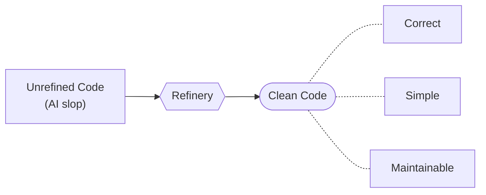

# Slop Refinery

Even the best frontier coding models generate AI slop by default. They can produce code that works well enough to ship a feature, but not code that is consistently clean. `slop-refinery` exists to help AI agents refine that output into clean code.

Clean code, in this repo, means code that is correct, simple, and maintainable.



## Index

- [Installation](#installation)
- [Usage](#usage)
- [Skills](#skills)
- [ESLint Plugin](#eslint-plugin)
- [Clean Code](#clean-code)
- [Correct](#correct)
- [Simple](#simple)
- [Maintainable](#maintainable)

## Installation

Use `npx skills`. Right now, the only thing you need to install from this repo is the setup skill.

```bash
npx skills add HOWMZofficial/slop-refinery --skill slop-refinery-setup
```

Then use `slop-refinery-setup` in the target repository. It will guide the AI to wire up the package, configs, scripts, and agent instructions.

## Usage

Right now, this repo does one thing: it helps an AI agent adopt `eslint-plugin-slop-refinery` in another repository.

In practice, you use `slop-refinery-setup`. That setup skill tells your AI to install the ESLint plugin, create the repository scripts, and update the agent instructions file so those checks run after code changes.

The scripts it sets up are:

- `format`
- `lint`
- `typecheck`

That is the current scope of `slop-refinery` for now.

## Skills

Current skills:

- `slop-refinery-setup`: adopts the `slop-refinery` skills and `eslint-plugin-slop-refinery` in a repository.
- `slop-refinery-automated-checks`: runs the repository's automated checks in the expected order.

## ESLint Plugin

This repo publishes [`eslint-plugin-slop-refinery`](https://www.npmjs.com/package/eslint-plugin-slop-refinery).

The ESLint plugin attempts to codify and automate best practices that are quick and easy for an AI agent to verify against.

Many of the rules are off-the-shelf. Some are custom.

AI now makes it practical to create more elaborate ESLint rules that would have been too expensive or tedious to build before. `slop-refinery` is meant to be a solid general-purpose base, not the final word.

You should create your own ESLint rules with AI for the conventions and architectural constraints that matter in your codebase.

## Clean Code

`slop-refinery` defines clean code as code that is:

- correct
- simple
- maintainable

### Correct

Correct code behaves as intended under normal, edge, adversarial, and high-scale conditions.

### Simple

Simple code is easy to read and easy to reason about. It uses just enough code to get the job done, but no more, and avoids unnecessary complexity.

### Maintainable

Maintainable code is easy to change without breaking unrelated behavior. It stays understandable and retains the properties of correctness and simplicity as the codebase grows.
