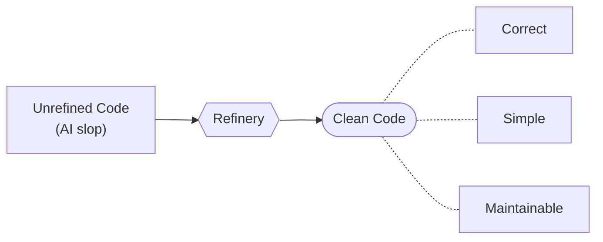

# Slop Refinery

`slop-refinery` combines three parts that keep agent-written code clean:

- Run `slop-refinery-setup` once. It installs the skills, Prettier, strict ESLint rules, TypeScript checks, and instructions in `AGENTS.md` or `CLAUDE.md`.
- For routine changes, those instructions tell the agent to run `slop-refinery-quick-checks`. It formats, lints, type-checks, and reviews the change for irreducible simplicity.
- For feature work, use `slop-refinery-pipeline`. It takes the feature through a much more thorough process, with you approving the plan before implementation and the result before completion.

Setup and quick checks keep everyday work clean. The pipeline is what to reach for when building a feature.


```mermaid
flowchart LR
    A["Unrefined Code<br/>(AI slop)"] --> B{{"Refinery"}}
    B --> C(["Clean Code"])
    C -.- D["Correct"]
    C -.- E["Simple"]
    C -.- F["Maintainable"]
```

## Set up a repository

Install the setup skill in a TypeScript repository:

```bash
npx skills add HOWMZofficial/slop-refinery --skill slop-refinery-setup
```

Then tell your coding agent:

```text
Use slop-refinery-setup in this repository.
```

The setup skill preserves the repository's existing conventions while it:

- installs the other four Slop Refinery skills
- configures the `slop-refinery` ESLint rules, Prettier, and TypeScript
- adds `format`, `lint`, and `typecheck` scripts
- updates the repository's agent instructions
- adds the pipeline checklist to the GitHub pull request template without deleting repository-specific content
- installs dependencies and fixes setup problems until the checks pass

## Build a feature with the pipeline

Use the pipeline for a feature that should go through the full GitHub workflow:

```text
Use slop-refinery-pipeline to implement <feature>.
```

The pipeline changes Git and GitHub state. It creates commits, pushes the branch, opens or updates the pull request, and can enable auto-merge. Use `slop-refinery-quick-checks` instead when you only want to validate local changes.

The pipeline works in this order:

1. It creates a feature branch, draft pull request, and linked issue. The draft starts with the installed pull request template.
2. It works with you until the problem and the smallest sound plan are clear. It waits for your permission before implementation.
3. It implements the feature, commits and pushes it, then runs thirteen independent reviews covering behavior, testing, design, code, edge cases, security, performance, and user experience.
4. It fixes clear problems. It records consequential choices, compatibility concerns, blockers, and disproportionate edge cases as unchecked tasks in the pull request for you to decide.
5. After that review, it syncs with the latest `main`, audits the final diff and files, runs every required check, and commits and pushes any fixes.
6. It waits for your final permission before marking the pull request ready and enabling auto-merge.

## Other skills

- `slop-refinery-quick-checks`: formats, lints, type-checks, and simplifies the current changes until all checks pass.
- `slop-refinery-irreducible-simplicity`: removes everything that is not needed for a target's essential purpose.
- `slop-refinery-eslint-tests`: writes focused Vitest coverage for custom ESLint rules, with ten valid and ten invalid examples per rule.

## Package tools

The [`slop-refinery`](https://www.npmjs.com/package/slop-refinery) npm package also provides an ESLint plugin, ruleset commands, Git cleanup commands, and a TypeScript API.

```bash
slop-refinery ruleset pull
slop-refinery ruleset push
slop-refinery git-cleanup
slop-refinery git-cleanup --apply --keep-archives
slop-refinery git-cleanup --prune-archives
```

The ruleset commands use the current checkout's `origin` repository and require an authenticated `gh` CLI. `git-cleanup` audits local branches and worktrees. `--apply` removes only branches proven to be preserved on the live default branch, `--keep-archives` keeps its safety refs, and `--prune-archives` removes redundant archives.

```ts
import { buildGitCleanupReport, pullRuleset, pushRuleset } from 'slop-refinery';
import { formatConfig, recommendedConfig } from 'slop-refinery/eslint-plugin';
```

The root API provides ruleset, Git cleanup, and file helpers. The ESLint subpath provides the lint and format configs.
